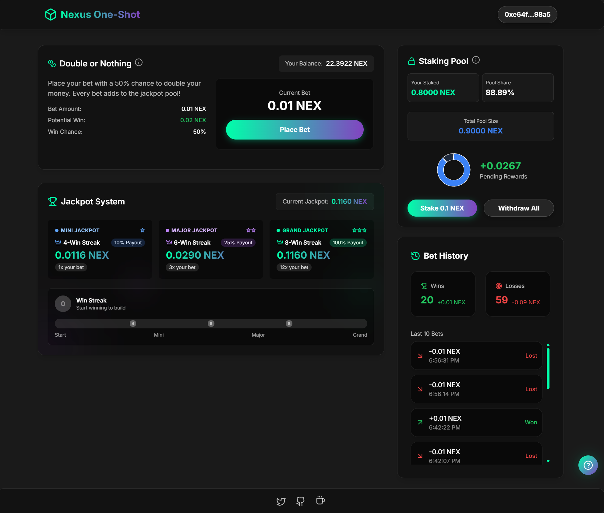

# 🎮 Nexus One-Shot - Web3 Gaming Platform 🎲

[](https://github.com/TheOnlyDeFiSage/one-shot)
[](../LICENSE)

## 📝 Overview

Nexus One-Shot is a decentralized gaming platform built on blockchain technology that offers a fair, transparent betting system with staking rewards. The platform combines engaging gameplay with DeFi mechanics to create a unique gaming experience.



## ✨ Features

- 🎯 **50/50 Betting**: Double or nothing betting system with provably fair outcomes
- 💰 **Token Staking**: Stake tokens to earn rewards from betting fees
- 🏆 **Jackpot System**: Win additional rewards by building winning streaks
- 📱 **Responsive Design**: Beautiful glass UI that works on all devices
- 🔐 **Secure Wallet Integration**: Connect with popular Web3 wallets
- 📊 **Bet History**: Track your gaming history in real-time
- 💸 **Developer Support**: Support development through cryptocurrency donations

## 🛠️ Technologies

- ⚛️ **React 18** - Frontend library
- 🔷 **TypeScript** - Type safety
- 🎨 **TailwindCSS** - Styling
- ⚡ **Vite** - Build tool
- 🔗 **ethers.js** - Ethereum interactions
- 🔧 **Lucide React** - Beautiful icons

## 🚀 Getting Started

### Prerequisites

- Node.js (v16+)
- npm or yarn
- Rabby (Highly recommended), MetaMask or other Web3 wallet

### Installation

1. Clone the repository:
   ```bash
   git clone https://github.com/TheOnlyDeFiSage/one-shot.git
   cd one-shot/UI
   ```

2. Install dependencies:
   ```bash
   npm install
   # or
   yarn install
   ```

3. Start the development server:
   ```bash
   npm run dev
   # or
   yarn dev
   ```

4. Open your browser and navigate to `http://localhost:5173`

### Building for Production

```bash
npm run build
# or
yarn build
```

The built files will be in the `dist` directory, ready to be deployed.

## 🎮 How to Play

1. **Connect Your Wallet**: Click the "Connect Wallet" button in the top right corner
2. **Place a Bet**: Choose the bet amount and click "Place Bet"
3. **Win or Lose**: You have a 50% chance to double your money
4. **Build Streaks**: Win consecutive bets to qualify for jackpot rewards
5. **Stake Tokens**: Stake your tokens to earn passive income from the platform fees
6. **Support Development**: Use the "Buy me a coffee" button to support ongoing development

## 🏗️ Project Structure

```
/
├── UI/                   # Frontend application
│   ├── src/              # Source files
│   │   ├── components/   # React components
│   │   ├── contracts/    # Contract interfaces and wallet context
│   │   ├── assets/       # Static assets
│   │   └── App.tsx       # Main application component
│   └── public/           # Public static files
│
└── Contracts/            # Smart contract code
    ├── V1/               # First iteration of smart contracts
    ├── V2/               # Second iteration
    ├── V3/               # Third iteration
    └── V4/               # Current version of smart contracts
```

## 🔧 Smart Contracts

The platform interacts with the following smart contracts **currently deployed on Nexus Labs Devnet**:

- **Game Contract**: Handles bets and determines win/loss outcomes
- **Balance and Staking Contract**: Manages token staking, balances, and reward distribution

Contract addresses:
- Game Contract: [0x7D8ded9cDdEced4Ff3b85E62E1e5B0cD74686472](https://explorer.nexus.xyz/address/0x7D8ded9cDdEced4Ff3b85E62E1e5B0cD74686472)
- Balance and Staking Contract: [0x3E019983C7BE92757Aa795A49D13fb3F3b7EF24D](https://explorer.nexus.xyz/address/0x3E019983C7BE92757Aa795A49D13fb3F3b7EF24D)

## 🤝 Contributing

Contributions are welcome! Please feel free to submit a Pull Request.

1. Fork the repository
2. Create your feature branch (`git checkout -b feature/amazing-feature`)
3. Commit your changes (`git commit -m 'Add some amazing feature'`)
4. Push to the branch (`git push origin feature/amazing-feature`)
5. Open a Pull Request

## 📜 License

This project is licensed under the MIT License - see the [LICENSE](../LICENSE) file for details.

## 🔮 Coming Soon

- 🎲 More game modes and betting options
- 🏅 Achievements and rewards system
- 🌐 Multi-chain support

## 📞 Contact

- Twitter: [@DeFi_Sage](https://x.com/DeFi_Sage)
- GitHub: [TheOnlyDeFiSage](https://github.com/TheOnlyDeFiSage)

## 🙏 Support

If you like this project, please consider supporting the development:

- ETH/Base: `0xe64Fbb605c74f194BffB64Ba33911023aAFa98a5`

---

Made with ❤️ by DeFi Sage 
